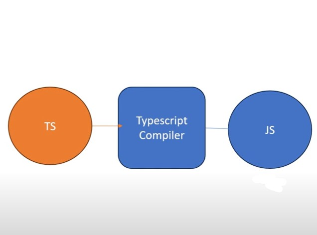

<h2>Introduction</h2>
<ul>
      <li>TypeScript is a superset of Javascript.</li>
      <li>
            

                  TypeScript builds on top of JavaScript.       
                   
                  First, you write the TypeScript code.  
                    
                  Then, you combile the TypeScript code 
                   
                  into plain JavaScript code using 
                   
                  TypeScript compiler.  
            

      </li>
</ul>

 
 

 
 
<h2>Why Typescript</h2>
<ul>
      <li>
            Introduce optional types to JavaScript.  
            That means that typescript don't have the same issue with types as javascript
      </li>
      <li>
            

                  Implement planned features of future  
                   
                  Javascript, a.k.a ECMAScript Next or Es  
                    
                  Next to the current Javascirpt.
                   
            

      </li>
</ul>

 
 

 
 
<h2>Setup</h2>
<ul>
      <li>
            Install Node.js
      </li>
       
      <li>
                     <pre><code class="language-bash">npm install -g typescript</code></pre>
      </li>
       
      <li>
              <pre><code class="language-bash">tsc --v</code></pre>
      </li>
       
      <li>
      To Compile file:
       
       
              <pre><code class="language-bash">tsc app.ts</code></pre>
      </li>

</ul>
